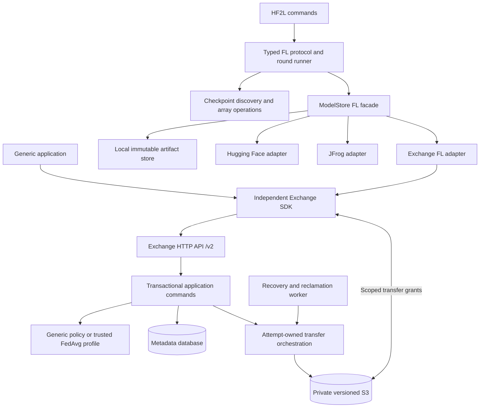

# HF²L architecture v3

V3 combines the generic exchange implementation developed in `hf_fl-v2` with
the useful application boundaries proposed in the current checkout's
[architecture review](history/ARCHITECTURE_REVIEW.md). It is an integration and
maintenance design for this repository, not a third incompatible wire protocol.
The Exchange HTTP API remains `/v2`; existing HF²L manifest versions, filenames
and command aliases remain readable. Python 3.10 remains supported.

This document is the implementation contract. The associated
[Exchange runbook](EXCHANGE_V3.md) distinguishes combined verification results
from earlier sibling-checkout evidence. A design section is not itself proof
that its acceptance tests passed.

## Baselines and implementation provenance

The current checkout started this integration on branch `redesign` at `0564c2b`.
It contained the original HF²L application and Exchange v1 service, plus review
documents and preparatory test artifacts. In particular,
`tests/support/scenarios.md` inventories legacy behaviors; its original empty
coverage column did not mean those behaviors had replacement tests.

The independent `hf_fl-v2` checkout contains an actual implementation of its
[v2 design](history/ARCHITECTURE_REVIEW_AND_V2_DESIGN.md), not only a proposal.
Its source, tests and operational procedures are integrated into the
current checkout. The sibling's historical
[runbook](history/EXCHANGE_V2.md) records its own verification; those counts must
not be reused as evidence for the combined code. No new implementation branch,
commit, push, service deployment or package publication is part of this change.

| V2 design requirement | Incorporated implementation | Verification anchor |
|---|---|---|
| Independent SDK and optional server dependencies | `packages/exchange/pyproject.toml`, `src/hf2l_exchange/client.py` | `packages/exchange/tests/test_boundaries.py`, `scripts/check_exchange_dependencies.py` |
| Generic records, immutable type revisions and separate policy | `hf2l_exchange/application.py`, `models.py`, `schemas.py` | `test_application.py`, `test_integration.py` in the independent package |
| Generic coordination plus optional trusted FedAvg policy | `hf2l_exchange/application.py`, `profiles.py` | `test_foundation.py`, `test_application.py`, `test_integration.py` |
| Owned multipart attempts, exact-version verification and delayed reclamation | `hf2l_exchange/transfers.py`, `storage.py`, `worker.py` | `test_transfers.py`, `test_recovery.py` |
| Durable uncertainty after interrupted provider mutations | Transfer markers and `repair-transfers` in `hf2l_exchange/cli.py` | `test_transfers.py`, `test_recovery.py`, `test_http.py` |
| Explicit schema ledger and command-specific configuration | `hf2l_exchange/migrations.py`, `config.py`, `cli.py` | `test_foundation.py`, `test_http.py` |
| Typed SDK, resumable transfers and token isolation | `client.py`, `client_types.py`, `client_state.py`, `transfer_client.py` | `test_client.py`, `test_integration.py` |
| Explicit HF²L round/acquisition context and publication capabilities | `hf2l/backends/exchange.py`, `hf2l/fedavg_runner.py` | `tests/test_fedavg_v2.py` |

`hf2l_exchange/` paths in this table are relative to
`packages/exchange/src/`. Test names alone do not establish provider or process
coverage; the runbook records which configurations actually ran.

## Decisions from the two reviews

The historical review proposed a complete rewrite with new filenames, manifest
schema 3, a redefined `/v1`, a workflow profile language and one large package.
The sibling v2 independently solved the metadata/blob exchange problem with a
smaller application boundary. V3 selects the following combination.

| Review concept | Decision | V3 implementation or reason |
|---|---|---|
| Generic authenticated metadata and blob service | Accept v2 | Independent `hf2l-exchange`; generic clients use its SDK directly |
| One protocol vocabulary and typed documents | Accept with narrower scope | `hf2l/core/protocol.py` owns FL documents; Exchange owns its separate wire vocabulary; preserve existing formats |
| Replace every backend with a new generic `ArtifactStore` | Defer | `ModelStore` remains an explicit FL facade in `hf2l/core/ports.py`; a second generic abstraction would duplicate the Exchange SDK without a demonstrated caller |
| Explicit capabilities and operation context | Accept | Immutable round/ref/claim values and lazy backend registry; decisions use capabilities rather than backend names |
| Local store and backend contract tests | Accept | A real single-host store provides immutable snapshots, atomic reference preconditions and explicit local participant identity |
| Library runner and thin command edge | Accept | Typed `RoundConfig`, `RoundResult` and reusable `run_round`; diagnostics returned as data; CLI renders them |
| Replace trusted training plugins with a new versioned plugin protocol | Defer | Retain current plugin entry points; typed FL documents and runner boundaries do not require rewriting trusted training code |
| Aggregation algorithm seam | Modify | FedAvg supports examples/uniform weighting and an injected strategy; defer FedProx until client algorithm propagation and training semantics are implemented together |
| Framework-neutral checkpoint operations | Accept | Header-only layout discovery, NumPy/Torch array implementations and one averaging policy; retain numeric and shard-streaming oracles |
| New filenames, manifest schema 3 and deleted aliases | Reject for this integration | Architecture version 3 does not require breaking published FL documents or operator commands |
| One command entry point | Modify | Add the `hf2l` dispatcher; keep existing console scripts and module entry points |
| JSON workflow profile language supplied by clients | Defer | Generic behavior plus trusted installed `fedavg.v1` supplies the actual use cases without a new policy language |
| Mutable single kind schema | Prefer v2 | Immutable type revisions prevent later registration from silently changing an existing draft's content contract |
| Profile required for all coordination | Prefer v2 | Generic acquisitions accept explicitly selected records without FedAvg vocabulary |
| Atomic publication required of every backend | Modify | Advertise actual guarantees: HF, Exchange and Local can enforce publication preconditions; JFrog requires a single writer and offers a preflight check |
| Replace migrations with `create_all` | Prefer v2 | Preserve the explicit revision ledger, frozen baseline and refusal of incompatible schemas |
| Shared lease abstraction over every resource | Defer | Preserve tested transfer/acquisition ownership rules; do not force their different lifecycles into one abstraction |
| Central filesystem helpers | Accept | `hf2l/common/fs.py` owns reusable operations; `hub_helpers.py` remains a compatibility facade |
| Structured, generated contracts and dependency tests | Accept | Generate API/error/environment artifacts from implemented Exchange sources; verify package and import boundaries |
| Drop Python 3.10 for `StrEnum` | Reject | The useful design does not require a newer runtime floor |
| Delete old hardening tests before replacement | Reject | Keep regression oracles and map changed expectations explicitly |
| Additional blob providers, multi-issuer configuration, brokers, push delivery | Defer | These need distinct requirements and provider/deployment evidence |

These decisions merge concepts rather than combine every class and module from
both proposals. The historical document's open questions and estimated rewrite
schedule do not describe completed work or additional user approvals.

The historical review's twelve themes map to this design as follows: workflow
seams to generic Exchange profiles plus the FL strategy interface; vocabulary to
typed FL documents and generated Exchange contracts; backend size/contracts to
an explicit FL facade, capabilities and LocalStore; owner complexity to the
typed runner; protocol conventions to typed document boundaries while retaining
the plugin contract; framework assumptions to optional imports and array
operations; API/infrastructure complexity to the imported v2 layers and ownership
rules; cross-cutting conventions to common filesystem helpers and structured
results; test architecture to retained oracles and new contract/integration
suites; documentation to this comparison and current generated artifacts. V3
does not claim every lower-priority suggestion in every theme was implemented.

## Component boundaries



The generic exchange neither imports HF²L nor installs its ML libraries. Its
domain contracts are independent of HTTP and persistence; application commands
own transactions and authorization; HTTP parses and renders; storage translates
provider errors; the worker uses the same ownership rules as API requests.
There is one metadata service and one recovery worker, not a new microservice
for every layer.

HF²L `common` contains reusable filesystem operations. `core` contains typed FL
protocol values and the FL store port. Backends implement that port, while the
runner owns selection, checkpoint validation, averaging and publication. The
Exchange adapter translates FL operations into generic records and coordination.
Generic applications do not pass through `ModelStore`.

The root distribution installs NumPy and SafeTensors. Torch and Hugging Face are
optional extras loaded at the point of use. NumPy handles supported non-BF16
checkpoints; BF16 requires the Torch backend. Training examples require their
training dependencies. The independent SDK has HTTPX as its runtime dependency;
its server extra adds database, web, storage and identity libraries.

## Core contracts and invariants

### Metadata, policy and coordination

A space is the authorization and quota boundary. `reader`, `contributor`,
`publisher` and `admin` are explicit roles; administration alone does not grant
content access. Revocation blocks new content access and signed grants. It does
not invalidate an already issued bearer URL before that URL expires.

A draft pins an immutable type revision. Current kind policy and membership are
checked independently, including at publication. Published metadata and verified
attachment identities are immutable. Generic records require no participant,
training base, model filename or FedAvg kind.

References use an explicit generation precondition and do not have a
delete/recreate path that resets their generations. A profile protects only its
chosen references; generic spaces can use `main` for arbitrary content.
Acquisitions freeze explicit inputs and a reference generation, have renewable
fenced ownership, and allow at most one active acquisition per space/reference.
Successful completion updates the result, reference and event history atomically;
replay returns the recorded outcome.

The optional FedAvg profile adds participant attribution, shared model results,
protected `main` advancement and provenance checks. Automatic selection uses the
newest eligible submission per participant. Automatic aggregation may reject
malformed candidates and use a valid frozen subset of at least two; explicit
selection failures remain errors. Legacy inventory expectation S-050, which
aborted a whole automatic round for a shape-invalid input, is superseded by this
documented behavior. Check-only readiness inspects metadata; full aggregation
still verifies hashes and checkpoint compatibility before publication.

### Blob transfer and recovery

1. Reserve declared metadata and capacity before provider I/O. A size/hash
   declaration is not verification; publication requires the exact verified
   object version.
2. Each attempt owns its storage key and multipart handle. Database leases fence
   database commits; they cannot cancel remote storage side effects.
3. Provider I/O runs outside the space mutation transaction. Commit and release
   paths verify ownership on the database clock and cannot overwrite a successor.
4. Persist a separate mutation marker before initiating or completing provider
   work. A lost callback keeps the outcome uncertain even after the lease expires.
5. Cancellation moves bytes to pending reclamation. Cleanup waits for issued
   grants to expire and provider mutations to settle. It must not free physical
   capacity or allow metadata purge while an attempt could still create objects.
6. Uncertain orphan mutations have a bounded inspection and offline repair path.
   An operator must stop all writers and independently establish provider
   quiescence before clearing markers. Repair schedules recovery or cleanup; it
   does not declare remote deletion successful.
7. Persist SDK operation state before a creating request. Resume confirmed
   multipart parts and interrupted downloads; use a credential-free transfer
   client for signed URLs and verify final size/hash.

Blob capacity includes pending deletion. Retained-record and canonical-metadata
quotas also bound metadata-only growth. Terminal records continue consuming those
budgets until explicit eligible purge. Coordination provenance remains retained;
there is no history-erasure API. Cancellation and cleanup must remain possible
when an admission quota is exhausted.

Events form a retained authorized pull feed. Consumers persist cursors,
deduplicate, process terminal tombstones and reconcile after cursor expiry. This
is not a webhook delivery system. Event/idempotency retention is bounded; replay
after retention expires can create a new operation.

### FL documents, checkpoints and publication

Typed readers and writers own the accepted manifest versions and filenames.
Parsing validates immutable base identity, participant attribution, example
counts and checkpoint hashes before the runner trusts them. Compatibility
exports remain available while production callers use the canonical modules.
The client checks declared checkpoint hashes before writing its downloaded
round context, so a corrupt base is not recorded as a usable training input.

When supplied, `algorithm_spec` propagates from the round to client context and
submission. The owner checks its name, version and client-affecting parameters.
FedAvg declares weighting a server-only parameter: switching examples/uniform
weighting does not require clients to retrain. A legacy descriptive `algorithm`
string alone is not a structured algorithm identity. Custom strategies must
declare any server-only parameters explicitly; client-affecting parameters still
participate in eligibility checks.

Reference snapshots, round context and claim handles are explicit arguments.
The run-state file belongs to one logical operation, survives interrupted
responses and is distinct from the published model directory. A claim renewer
protects long downloads and averaging; ownership loss prevents publication.

Checkpoint discovery reads and validates SafeTensors headers, index membership,
tensor names, shapes, dtypes and safe paths without importing Torch. Averaging
has one policy implementation over array operations: finite values are required,
non-floating tensors must agree, coefficients are validated and accumulation
rules remain explicit. Numeric goldens and streaming tests verify behavior;
NumPy/Torch differences require measured tolerance rather than an unqualified
bit-identity claim across CPUs.

The local backend is a single-host POSIX implementation with immutable artifact
snapshots and atomic reference checks under an advisory filesystem lock. An
explicit local principal provides participant attribution; it is not remote
authentication. Filesystem access controls protect the store. It is not a
network service or a multi-host filesystem coordination guarantee.
All writers must use the adapter's locking protocol. Reserved revision names
cannot be shadowed by tags, downloads cannot target the storage namespace, and
atomic destination replacement prevents a pre-existing hard link from mutating
an immutable snapshot. Publication persists snapshot data before advancing a
reference. Source symlinks, path escapes and colliding artifact paths are refused.

A confirmed primary publication stays successful if a subsequent tag operation
fails. The result carries the committed revision and a separate warning. An
uncertain primary response requires reconciliation; blindly retrying a new
publication is unsafe. JFrog's documented single-writer restriction remains.
Automatic discovery can skip a malformed or deleted candidate; a backend outage
propagates as a round failure instead of being silently treated as an invalid
participant submission. HF/JFrog contract tests use deterministic SDK doubles;
they do not establish live remote-provider behavior.

## Integration and compatibility

Exchange v2 requires a fresh metadata database and storage prefix. It neither
serves `/v1` nor imports legacy Exchange data. V3 keeps this deployment rule and
does not reinterpret the old service's database.

The old `hf2l.exchange` service and its command remain available as a clearly
identified legacy surface for regression and explicit legacy use. New
`--backend exchange` application operations use the independent `/v2` service.
Do not point that adapter at the old service. Existing HF/JFrog document formats,
module entry points and console aliases remain supported during this integration.

The unified `hf2l` command composes existing client/owner tools; service commands
remain available through `hf2l-exchange`. Package version, architecture revision,
HTTP version, database revision, manifest schema and profile version are separate
identifiers. This change creates no release or compatibility promise for a future
schema change.

## Acceptance and verification

Generated contract files are checked against their source generators:

```bash
.venv/bin/hf2l-exchange export-contract --output-dir docs/generated
.venv/bin/hf2l export-contract --output docs/generated/fl-documents.json
```

The Exchange command emits `exchange-api.json`, `exchange-errors.json` and
`exchange-environment.md` without IdP or S3 configuration. The FL command emits
the accepted document schemas. These artifacts describe actual interfaces;
they do not introduce a new manifest version. OpenAPI reflects declared routes
and request schemas; currently untyped response bodies are not a complete set of
generated response DTOs. The error artifact records literal error/status pairs
and identifies dynamic forwarding sites; it does not claim every possible
provider or forwarded error is statically enumerated. FastAPI's default
validation models remain visible in the generated API document.

Programmatic orchestration uses the typed runner rather than constructing argv:

```python
from pathlib import Path
from hf2l.fedavg_runner import run_round
from hf2l.round.config import RoundConfig

result = run_round(store, RoundConfig(
    repo_id="example/model", output_dir=Path("work/round-1"),
    selection="discover", weighting="examples", array_backend="numpy",
))
summary = result.to_dict()
```

`RoundResult` reports readiness/aggregation/publication status, eligible and
skipped candidates, warnings and any confirmed publication. An application can
pass an `Aggregator` implementation through `run_round(..., aggregator=...)`;
its coefficients and reduction behavior remain explicit. CLI output is an edge
concern, and `--json` renders the structured result.

| Boundary | Required evidence |
|---|---|
| Generic use | Metadata-only and arbitrary-file exchanges without model vocabulary; generic and FedAvg spaces coexist |
| Policy | Role matrix, revoked members, current-policy publication checks, protected-reference non-bypass and terminal visibility |
| Type evolution | New schema registration affects new drafts while existing records retain their pinned revision |
| Transfers | Exact versions, multipart resume, credential isolation, delayed cleanup, lost callbacks and safe offline repair |
| Coordination | Competing CAS writers, stale fence refusal, completion replay, subset provenance and process interruption |
| FL contracts | Typed document round trips, invalid input rejection, legacy versions, common immutable base and participant binding |
| Backend behavior | Local/HF/JFrog/Exchange capabilities, publication preconditions, confirmed primary plus failed tag |
| Numeric behavior | Existing goldens, finite/non-floating rules, NumPy/Torch comparison and bounded shard streaming |
| Packaging | Fresh minimal root/SDK/server environments, lazy optional imports, both wheels and dependency checks |
| Integration | Root regression suite plus independent Exchange suite with SQLite/Moto and PostgreSQL/MinIO |
| Documentation | Generated contracts match implemented sources; commands/examples execute; historical claims are labeled |

The original golden fixtures and behavior inventory are retained as evidence
sources. Each replaced or changed behavior needs a current test mapping or an
explicit superseded/deferred explanation. The repository need not discard
working old regression tests to achieve clean new package boundaries.

Current combined run results belong in [EXCHANGE_V3.md](EXCHANGE_V3.md).
Local tests do not establish production throughput, live Hugging Face/JFrog
behavior, TLS/IAM/identity configuration, backup/restore objectives or remote CI
status. Those claims need separate deployment or provider evidence.
