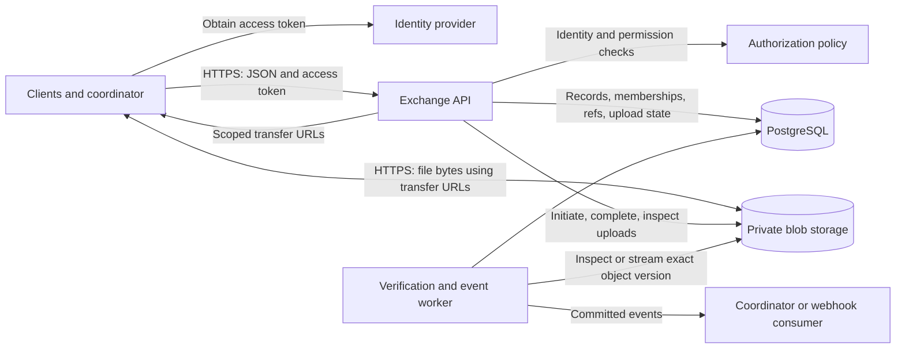
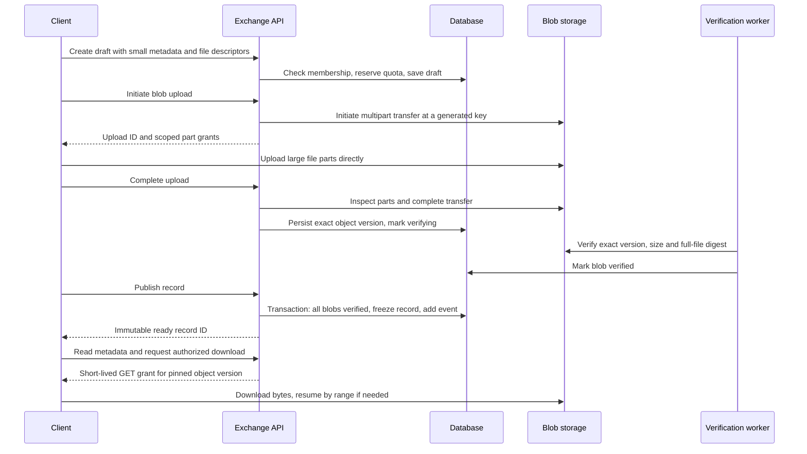

# General metadata exchange and blob storage

Status: architecture design with an initial implementation. See the
[implementation and deployment guide](EXCHANGE_SERVICE.md) for supported APIs,
operational boundaries, and validation. No production infrastructure has been
provisioned.

The proposal splits the current combined HF/JFrog backend into a metadata
service backed by PostgreSQL and a private object store. Clients exchange small
JSON records through the service and transfer large files directly to object
storage. Authentication and authorization are enforced by the service, which
delegates narrowly scoped transfer access to storage.

The API provides capabilities similar to the current backends, with its own
resource model. It does not reproduce the Hugging Face HTTP API. FedAvg becomes
one application using the service; arbitrary artifacts, metrics, configuration,
task results, and metadata-only messages use the same primitives.

## 1. Components and responsibilities



| Component | Owns |
| --- | --- |
| Identity provider | Human/workload identities, login, access-token issuance and signing keys |
| Exchange API | Permission decisions, small-information CRUD/query operations, upload reservations, download grants, reference updates |
| PostgreSQL | Authoritative metadata, memberships, ownership, record states, exact blob versions, event feed state (audit decisions are retained in deployment logs) |
| Blob storage | Large immutable object versions, multipart transfer, storage-side request signature and integrity checks |
| Worker | Upload verification/recovery, expiry cleanup, durable event delivery |
| Application coordinator | Domain validation, participant selection, aggregation or another computation, result publication |

Use a Python API service, PostgreSQL, and an S3-compatible storage adapter as
the initial implementation. An ASGI framework such as FastAPI fits the existing
Python project. Keep framework and object-store dependencies outside the
lightweight client SDK. Start with the API and worker sharing one codebase and
database; a separate message broker is unnecessary for the first version.

The API normally carries no file bytes. A verification worker may stream a
completed object when storage cannot verify the required full-file digest.
This adds a storage read, not a client upload through the API.

## 2. Generic resource model

| Resource | Meaning | Mutability |
| --- | --- | --- |
| Tenant | Administrative and data isolation boundary | Administrative changes only |
| Space | Authorized project namespace with an optional tenant label; replaces a model repository | Policy and memberships can change |
| Record | A small JSON document, optional base record, and zero or more named blob attachments | Draft is editable; ready content is immutable |
| Blob | One uploaded file owned by a record | Exact verified version is fixed at publication |
| Reference | Named pointer such as `main`, `latest-config`, or `approved-report` | Compare-and-swap update only |
| Upload | Resumable transfer reservation belonging to a blob and its uploader | Controlled transfer lifecycle |
| Event | Durable notification of a committed resource change | Append-only |

Each record has a server-assigned ID, `kind`, `schema_version`, optional
`base_record_id`, `metadata`, attachment descriptors, and server-assigned
creator/time/state. Examples of kinds are `training.update`, `model.global`,
`evaluation.result`, `configuration`, and `message`. Kind-specific metadata
schemas and allowed creator roles are configured per space and can be changed
later; a changed visibility flag is applied to the kind's existing records in
the same transaction, so policy is never frozen into a record. Schemas are
self-contained: only in-document references are accepted, validation uses a
registry without a retrieval callback, and an unresolvable rule fails the
affected records with a client error rather than a server fault. A client
cannot gain publishing privileges by choosing `kind=model.global`.

A record with no attachments supports small-information exchange alone. A
record with one attachment supports the requested big-file exchange. Multiple
attachments support existing sharded checkpoints without packing them into
an archive. New versions are new records; old content remains addressable.

`base_record_id` is an immutable same-space relationship. It records declared
provenance and enables round filtering; it does not prove that a client used
the base during training. Arbitrary application records need not have a base.

Use opaque record/blob IDs, independent of bucket keys or Git SHAs. References
resolve to record IDs. URLs are temporary transfer credentials and must never
be persisted as the identity or storage location of a blob.

Suggested initial limits: 64 KiB of metadata per record, paginated attachment
descriptors, bounded JSON depth, and a configurable file/count/byte quota per
space and principal. These are service policy defaults, not object-store
limits. Quota reservations are atomic and include pending uploads. The
metadata limit is reported with its size and limit (`metadata_too_large`) and
pre-checked by the SDK before a draft exists; applications that aggregate
unbounded metadata (the FedAvg round record) must bound what they store inline
and attach the rest. Attachment names are unique case-insensitively, never
nest as file and directory, and never shadow an inline manifest name, so a
record can always be materialised as a directory.

## 3. Authentication and authorization

Clients obtain OAuth access tokens from a configured identity provider. Human
CLI clients use a supported interactive flow; unattended clients use workload
identity federation or a dedicated service principal. The service never asks
clients to share an owner credential.

For JWT access tokens, validate the signature using trusted issuer keys,
permitted algorithms, issuer, API audience, expiry, and token type. Identify a
principal by the exact `(issuer, subject)` pair; usernames and display names
are not authorization keys. Use access tokens intended for this API, not OIDC
ID tokens. This follows the resource-server validation model in
[RFC 9068](https://www.rfc-editor.org/rfc/rfc9068.html).

The API resolves space membership from its database on every
authorized operation, including URL renewal. Token scopes set an upper bound;
they do not replace resource-level checks. Request JSON cannot set creator,
tenant ownership, verified checksums, trusted roles, or approval state.

| Operation | Reader | Contributor | Coordinator | Space admin |
| --- | --- | --- | --- | --- |
| Read shared ready records and download their blobs | Yes | Yes | Yes | Explicit data role required |
| Create own records and upload their attachments | No | Yes, allowed kinds | Yes, allowed kinds | Explicit data role required |
| Read own private drafts/submissions | No | Yes | Own records | Explicit data role required |
| Read other participants' submitted updates | No | Only if space policy shares them | Yes | Explicit data role required |
| Publish an approved result or move `main` | No | No | Yes | Explicit data role required |
| Change memberships, kind rules, quotas, retention | No | No | No | Yes |

Every download checks access to the containing record as well as blob state.
Knowing an ID, digest, bucket key, or base ID never grants access. Query results,
counts, pagination, and events apply the same visibility rules as direct reads.
Unauthorized cross-space IDs return a non-disclosing error.

For a fully shared information exchange, configure contributor-created ready
records to be readable by all space members. For FL, use a policy where client
updates are visible to their creator and coordinators, while approved global
models/configuration are readable by all participants. The service chooses the
effective visibility from policy; contributors cannot widen it themselves, and
an admin's later policy change applies to existing records as well.

Storage remains private. End clients receive no persistent bucket credentials,
list permission, delete permission, or arbitrary-key write access. Only service
workload identities can initiate/complete multipart uploads and sign grants;
separate cleanup credentials authorize deletion. Use TLS, encryption at rest,
and a per-deployment or per-tenant storage boundary as required.

Transfer grants bind one operation, object key/version, and short expiry;
multipart grants additionally bind upload ID and part number. A five-minute
grant is an initial policy, with authenticated renewal for long transfers.
Signed URLs are reusable bearer capabilities until expiration, not one-time
credentials. Revoking membership stops new grants, but an existing grant or
already-started transfer may remain usable. Strict immediate revocation would
require an authenticated transfer gateway. These limitations follow the
[S3 presigned-URL model](https://docs.aws.amazon.com/AmazonS3/latest/userguide/using-presigned-url.html).

## 4. API sketch

All paths below are under `/v1/spaces/{space_id}` unless noted. Ordinary calls
use `Authorization: Bearer ACCESS_TOKEN`; blob transfers use only the issued
grant and its required headers. The SDK must not forward the API bearer token
to storage. Resource responses contain IDs and descriptors, not permanent
download URLs.

| Method and path | Purpose |
| --- | --- |
| `POST /v1/spaces` | Authorized administrator creates a space |
| `GET /v1/spaces/{id}`, `PATCH /v1/spaces/{id}` | Space admin reads or changes quota, per-principal quota and kind rules with `If-Match` |
| `GET /members`, `PUT /members/{principal_id}` | Administrator lists members or assigns explicit space roles and the participant binding; empty roles revoke the member, release every draft it holds and exclude its ready `training.update` records from claims (even if the participant string is kept), while a binding change releases only its participant-bound (`training.update`) drafts. The last admin cannot be removed or demoted; the bootstrap admin may use these two routes without membership as an audited break-glass |
| `GET /refs/{name}` | Resolve a named reference to an immutable record and generation |
| `POST /records` | Create a draft with metadata and declared attachment names, sizes, SHA-256 values |
| `PATCH /records/{id}` | Update own draft metadata using `If-Match`; attachment declarations freeze once transfer begins |
| `GET /records/{id}` | Read authorized metadata, state, provenance and paginated attachment descriptors |
| `GET /records?kind=...&base_record_id=...&state=ready&cursor=...` | Find authorized small-information records without downloading blobs |
| `POST /records/{id}/blobs/{blob_id}/uploads` | Reserve/initiate a transfer and return its protocol and required headers |
| `POST /uploads/{id}/parts:authorize` | Issue or renew a bounded batch of multipart part URLs |
| `GET /uploads/{id}` | Read transfer state and server-observed uploaded parts for resume |
| `POST /uploads/{id}:complete` | Ask the service to complete and verify an upload |
| `DELETE /uploads/{id}` | Abort an owned upload that is still `reserved`, `initiating` or `uploading`; completing, verifying and verified blobs are protected (`409`); cleanup is retryable |
| `POST /records/{id}:publish` | Freeze metadata and atomically make a record ready after all blobs verify |
| `DELETE /records/{id}` | Cancel an own draft (admins: any draft), or withdraw an own unreferenced ready record |
| `POST /claims`, `GET /claims`, `GET /claims/{id}`, `POST /claims/{id}:renew`, `POST /claims/{id}:publish`, `POST /claims/{id}:abandon` | Coordinator freezes newest-per-participant (or explicit) inputs under a fenced lease, publishes a subset-provenanced result, or releases the claim. Automatic freezing reports `superseded` and (binding-changed or creator-revoked) `skipped` updates; acquisition is idempotent for the current acquisition key, with separate keys treated as separate jobs; `claim_busy` names the active claim; coordinators and admins can list claims by base, workflow and activity |
| `POST /records/{id}/blobs/{blob_id}:download` | Authorize a GET/range transfer of the exact published object version |
| `PUT /refs/{name}` | Coordinator updates a reference with `If-Match` generation, or creates with `If-None-Match: *` |
| `GET /events?cursor=...` | Read a resumable, authorized event stream |

The query API exposes explicit indexed filters and configured metadata fields;
it does not accept arbitrary SQL or unrestricted JSON expressions. Use stable
cursor pagination with a snapshot boundary so clients can iterate without
missing concurrently inserted records. A missing attachment is not represented
as an empty successful download.

Creating mutations (`POST /v1/spaces`, `POST /records`, `PUT /refs/{name}`, `POST /claims`)
require a 1–128-character `Idempotency-Key`. Store keys scoped to principal, space, route and
canonical request digest: the same request returns the same resource/result;
reusing a key with different content returns `409`. The stored operation is
inserted under a savepoint so that two concurrent requests with one key, which
can race where no space row lock serializes them (space creation), both return
the single stored result rather than a conflict. Retain creation keys at least
for the upload lifetime and the documented retry window. Replayed responses
still require current authorization. A repeated claim acquisition key returns
the same still-active attempt. Other state-machine mutations use their own
state for retries: a completed upload reports its state. URL renewal issues new
credentials rather than replaying expired URLs.

Return `202` and an observable operation/upload state for asynchronous
verification, `409` for invalid state or idempotency conflicts, `412` for failed
reference preconditions, `413` for oversized requests, and `429` for quota/rate
limits. All errors include a stable code and request ID; never echo credentials.

An illustrative create-record request:

```json
{
  "kind": "training.update",
  "schema_version": 1,
  "base_record_id": "rec_global_17",
  "metadata": {
    "round": 17,
    "num_examples": 12500,
    "metrics": {"loss": 0.42}
  },
  "attachments": [
    {
      "name": "model.safetensors",
      "size_bytes": 8589934592,
      "sha256": "0123456789abcdef0123456789abcdef0123456789abcdef0123456789abcdef"
    }
  ]
}
```

The digest above is illustrative. The response supplies `record_id`,
server-derived `created_by`/participant identity, state `draft`, and a blob ID
for each attachment. No claimed author field is accepted from the caller.

## 5. Upload, publication, and download



The client library hides these steps behind `put_record(metadata, files)` and
`get_record(id)` / `download_attachment(id, name)`, while exposing upload IDs
for durable resume. A metadata-only record follows the same publish step with
no transfers. Multiple blobs may upload concurrently; record publication waits
for every declared attachment.

Blob lifecycle: `reserved -> uploading -> verifying -> verified`, with
`failed` and `aborted` terminal outcomes for that attempt. Record lifecycle:
`draft -> ready -> withdrawn`; cancelled/expired drafts and withdrawn records
are never discovery candidates. Ready content cannot be edited; withdrawal is
an audited state change that releases quota and is refused while a reference,
a dependent record's lineage or an active claim depends on the record.
Published referenced records remain retained and readable according to policy.

The service generates an unguessable key, binds it to one blob/upload, and
records the exact object version returned by storage. It alone completes
multipart uploads after checking the observed part set, lengths, checksums,
and reserved quota. Completion accepts no caller-selected bucket or object key.
For small attachments, a signed single PUT can use the same verification path.

Require versioned objects in the first storage implementation. Pin verification
and all later reads to the chosen version. An old upload grant must never
change the bytes that a ready record names; a repeated single PUT may create
an unreferenced version, which cleanup can remove. Deny end-client deletion of
versions and prevent lifecycle rules from removing referenced versions. Unique
keys alone are insufficient to enforce immutability while upload grants exist.

Store the client-declared SHA-256 separately from the verified SHA-256. Object
metadata supplied by the uploader is not proof. Use storage-verified checksums
only when the provider exposes the matching full-object algorithm/semantics;
otherwise a worker streams the pinned version to calculate SHA-256 before
marking it verified. Multipart composite checksums and ETags must not be
mistaken for a full-file SHA-256. See
[S3 checksum semantics](https://docs.aws.amazon.com/AmazonS3/latest/userguide/checking-object-integrity-upload.html).
Readers also verify the declared length and verified digest after download.

Uploading bytes, completing a transfer, publishing a record, and selecting a
reference are separate states. Publishing a contributor's record makes its
data available under its visibility policy; it does not approve a global
result or move `main`.

## 6. Database and consistency

| Table | Essential fields/constraints |
| --- | --- |
| Identity provider | Issuer/subject identity and issuance lifecycle; immediate revocation also requires removing space memberships |
| `spaces` | ID, tenant label, policy, byte limits, allocated and pending-deletion counters |
| `memberships` | Unique space/principal; known subject; roles; optional coordinator-managed participant ID, unique within the space |
| `records` | ID, space, creator, kind, schema version, optional base, JSONB metadata, state, visibility policy, row generation |
| `blobs` | ID, space, record, attachment name, size, declared/verified digest, storage backend/bucket/key/version, state |
| Upload fields on `blobs` | Provider upload ID, expiry, completion/reconciliation state, renewable attempt token and lease |
| `refs` | Unique space/name, record ID, monotonic generation |
| `idempotency` | Scoped key, request digest, operation/result ID, retention deadline |
| `events` | Event ID, space, type, resource ID, timestamp; retained pull feed with a per-space expiry floor |
| Deployment audit logs | Principal, route/resource, status/code, timestamp, request ID; retained by the log collector |

Use same-space foreign-key constraints for base records, references and blob
associations. Index record discovery by `(space_id, kind, base_record_id,
state, created_at, id)`, and by creator for own-record queries. A unique
`(record_id, attachment_name)` constraint prevents ambiguous downloads.
Resolve all storage locators from trusted database rows.

There is no distributed transaction between PostgreSQL and object storage.
Use recoverable operations: persist a reservation before contacting storage,
persist the generated key and provider upload ID, then persist verification
before exposing a record. If a completion response is lost, reconcile the
reserved key's exact version and digest before retrying. Never adopt an
arbitrary object named by the client. An initiating upload whose response was
lost can be found/aborted by reserved key or expired by multipart lifecycle.

In one database transaction, publication locks the record and its blob rows,
rechecks authorization and states, changes the record to ready, settles quota,
and inserts a resource event. No storage read or lengthy computation runs while
these database locks are held. PostgreSQL provides the required
[row-lock semantics](https://www.postgresql.org/docs/current/explicit-locking.html).
Unfinished records remain invisible to normal discovery after crashes.

Reference updates require the exact generation returned by `GET /refs/main`.
Inside one transaction, verify coordinator permissions and target visibility,
lock the reference, check the expected generation, require a ready same-space
target, update the target/generation, and insert the event. The FL profile also
requires `main` to name a `model.global` record whose `base_record_id` equals
the current target, so no reader ever resolves `main` to a non-model record and
the lineage check cannot be bypassed through an intermediate kind. Bootstrap
uses conditional creation. Generations prevent a reference moved away and back
from passing an outdated update. Only one concurrent publisher can succeed.

Cleanup uses a grace period, live-reference checks and recorded object versions.
It aborts expired multipart uploads, releases reservations, and removes orphan
versions. It never blindly deletes by prefix or digest. Draft cancellation
denies further API grants immediately; bytes arriving under an outstanding
grant remain inaccessible and are reclaimed after grant expiry. Back up the
database and retain matching blob versions so a restored record remains usable.

## 7. FedAvg and event-driven jobs

FedAvg uses the generic service through an application profile. Version 1
ships exactly one such profile, built in and not configurable: it is keyed to
the kinds `training.update` (participant-bound, base required, private by
default) and `model.global` (shared, base-linked), to the `main` reference and
to the `input_record_ids` provenance field of a claimed result. The FL
guarantees below (participant and base requirements, the aggregate base check
on `main`, claim eligibility and result linkage) apply to those names only.
Custom kind rules may add kinds around them but must keep both profile kinds,
with `model.global` shared and its schema accepting `input_record_ids`; the
service rejects rule sets that do not (`profile_kind_required`,
`profile_kind_incompatible`). A second workflow needs its own profile, not a
renamed copy of this one.

1. The coordinator creates the initial `model.global` record and `main` ref.
2. Each participant reads `main`, pins its record ID, downloads its checkpoint,
   trains locally, then publishes a `training.update` with that base ID. The
   update carries the creator's server-bound participant. A rebinding cancels
   the creator's open `training.update` drafts, and the binding, together
   with the creator's continued membership (a member with roles `[]` holds no
   binding), is re-checked whenever an update is published, frozen into a
   claim (automatic freezing skips such updates, explicit inputs are
   refused), retained by an expired claim's re-acquisition, or declared by
   the aggregate that completes the claim, so an aggregate never attributes
   an update to a participant its creator no longer holds.
3. A `record.ready` event causes the coordinator to query ready updates for the
   current base and count distinct server-bound participant identities.
4. Once the threshold is reached, a coordinator transaction claims work for
   `(space, workflow, base)` and freezes exact input record IDs: the newest
   ready update per participant, or an explicit coordinator-supplied list.
   A unique claim prevents independent runners from selecting two competing
   input sets. Retries reuse the frozen set; late arrivals belong to a later
   owner decision and do not silently change in-flight work.
5. The worker downloads those blobs, validates checkpoint compatibility and
   application metadata, computes the aggregate over the inputs that passed,
   and publishes a result record declaring exactly those inputs.
6. The coordinator advances `main` with the captured reference generation; the
   service accepts the result only if its declared inputs are a subset of the
   frozen set. Stale workers fail the reference precondition; a crashed worker
   resumes from its durable claim. A round that cannot complete abandons its
   claim (holder with fence, or admin), so a single bad input never freezes
   `main`; the offending update is withdrawn and the base is claimed again.

The work claim is an optional coordinator table/API extension, not a requirement
for ordinary record exchange. If execution uses expiring leases, increment a
fencing generation and require the current generation for result acceptance
and reference advancement. This blocks a previous lease holder that resumes
after another worker has taken over.

Byte integrity does not establish model quality, honest example counts, or
training provenance. Existing tensor/schema validation and owner-controlled
evaluation remain in the FedAvg application. The service supplies authenticated
identity, immutable inputs, controlled visibility, and safe reference updates.

Events are read from a retained transactional cursor feed. Consumers persist
their cursor, deduplicate event IDs, and re-read current authorized state. An
expired cursor requires reconciliation with current records and references.
Outbound webhook subscriptions, delivery retries, acknowledgements and a
dead-letter queue are future extensions; they are not part of this API.

The existing GitHub workflow can consume a service event via a dispatch relay
or poll the service. Replace HF PR counting with ready-record discovery;
retain the base check and manual recovery path. The core service does not need
GitHub credentials unless a deployment enables that integration.

## 8. Integration with the current repository

The current [ModelStore contract](../hf2l/backends/base.py) already separates
client/owner behavior from HF and JFrog implementations. Introduce a generic
`ExchangeClient` for records, references and transfers, plus an `ExchangeStore`
adapter implementing `ModelStore`. The new backend name can be `exchange`.

| Current operation | Exchange mapping |
| --- | --- |
| `resolve_revision(repo_id, "main")` | Resolve space and reference to immutable record ID |
| `download_snapshot(...)` | Read one record; download only requested attachments; materialize small HF2L manifests from stored metadata |
| `initialize_repository(...)` | Create space, initial ready global record and conditional `main` reference |
| `publish_submission(...)` | Create record, upload attachments, verify and publish; leave `main` unchanged |
| `discover_submissions(...)` | Query ready update records; use authenticated creator/participant bindings |
| `explicit_submissions(...)` | Read selected immutable record IDs with authorization checks |
| `publish_aggregate(...)` | Upload/publish output record, then advance `main` using a reference precondition |

No Git commit DAG or PR emulation is required. Set `supports_ancestry=False`;
the service records explicit provenance and the adapter enforces the FL base
relationship. Preserve generic CLI aliases `--submission` and
`--discover-submissions`; HF-specific `--pr` flags remain HF-only.

Store `fedavg_round.json` and `fedavg_submission.json` content in the record's
HF2L metadata namespace (`hf2l_files`). The adapter reconstructs those files
for existing readers; config and checkpoint files retain their normal names
and hashes. Reject any mismatch between manifest identity/base and
server-owned fields. Those manifest names, and any key of `hf2l_files`, are
reserved: the service refuses attachments that equal, nest under or enclose
them, and the adapter refuses to publish or materialise such a record, so an
attachment can never shadow the checked inline copy. Metadata-only readiness
checks read inline manifests only and require no large-file reads. Because
the round record embeds every participant's training metadata, the adapter
keeps the inline copy within three quarters of the metadata limit and uploads
the complete manifest as `fedavg_round-full.json` when it would not fit.

Two explicit compatibility changes are needed beyond adding the adapter:

- Preserve the resolved reference generation alongside the base ID through
  aggregation, and pass it to `publish_aggregate`. A revision-only contract
  cannot fully express the reference precondition. HF/JFrog can keep their
  existing guards through optional backend capabilities.
- Introduce stable server-bound principal/participant fields. Do not send OIDC
  subjects through the existing case-folded HF username allowlist logic.
  Keep legacy allowlists for existing backends; enforce new membership at the
  service and optional application allowlists by stable IDs.

Use separate `EXCHANGE_ENDPOINT` and exchange token-provider configuration.
Storage endpoints/credentials are service deployment settings, not client
options. HF/JFrog remain usable backends, and checkpoint/training code remains
an application above the exchange SDK.

## 9. Delivery plan and acceptance criteria

First build authenticated spaces/memberships, metadata-only records, ready
record queries, and conditional references. Next add one versioned object-store
adapter, multipart upload/resume, checksum verification, quota accounting and
direct downloads. Then add the HF2L adapter and cursor-feed/coordinator integration.

Before declaring a storage implementation supported, verify its actual
versioning, signing, checksum, multipart, conditional operation and range-read
behavior. An S3-compatible endpoint must pass the same conformance suite; the
name alone is not a guarantee. Choose a storage product/version during
implementation against the target deployment's capacity and operational needs.

Required acceptance cases:

- A contributor can exchange metadata and files under the configured sharing
  policy, but cannot access an unenrolled space or move an owner reference.
- Body-supplied author/participant/visibility values cannot bypass policy.
- Expired or wrong-method/object/part grants fail; renewed grants require
  current membership; logs contain no bearer tokens or signed query strings.
- An interrupted multi-GB upload resumes without reuploading confirmed parts.
- Incomplete, oversized or checksum-mismatched blobs never become ready inputs.
- A replayed upload URL cannot change an already published record's bytes.
- Lost responses and process crashes at each upload/publication boundary
  recover without duplicate visible records, quota leaks or broken references.
- Two publishers using the same reference generation yield one success and one
  precondition failure; two coordinators use one durable frozen input set.
- Two distinct eligible updates for the same base trigger one accepted FedAvg
  result; old-base records and duplicate event deliveries cannot republish it.
- Retention and backup/restore preserve every live record's exact blob version.

This design delivers authenticated small-information exchange and authorized
large-file transfer independently of the federated-learning algorithm. It does
not require general Git hosting, an artifact-registry UI, or executing uploaded
client code within the service.

## Implemented v2 contract clarifications

The deployment/API contract is detailed in [EXCHANGE_SERVICE.md](EXCHANGE_SERVICE.md).
The implemented choices include:

- Space, not the free-text tenant label, is the authorization boundary. Tenant
  membership/delegation is not an implemented feature.
- Membership rows retain known subjects; legacy hashes require an external roster.
  Global identity disable is an IdP operation plus per-space membership revocation.
- The durable feed is pulled with a retained cursor. It has no outbound delivery
  state. Per-request audit decisions live in centrally collected application logs;
  database events are retained transactional resource events.
- Blob attempts have renewable owner tokens; lease decisions use the database
  clock. Physical pending-deletion bytes remain quota-accounted until cleanup.
- Acquisition keys identify claim runs, independently of the OAuth principal.
  All four keyed routes require a 1–128-character `Idempotency-Key` header.
- PostgreSQL uses JSONB, read snapshots and configurable pools. A repeatable
  `migrate-db` command upgrades the persisted v1 schema before v2 processes start.
- Fixed-profile schemas are restricted at configuration time so composed rules
  cannot silently forbid the required FedAvg fields. General schemas belong to
  custom record kinds.
