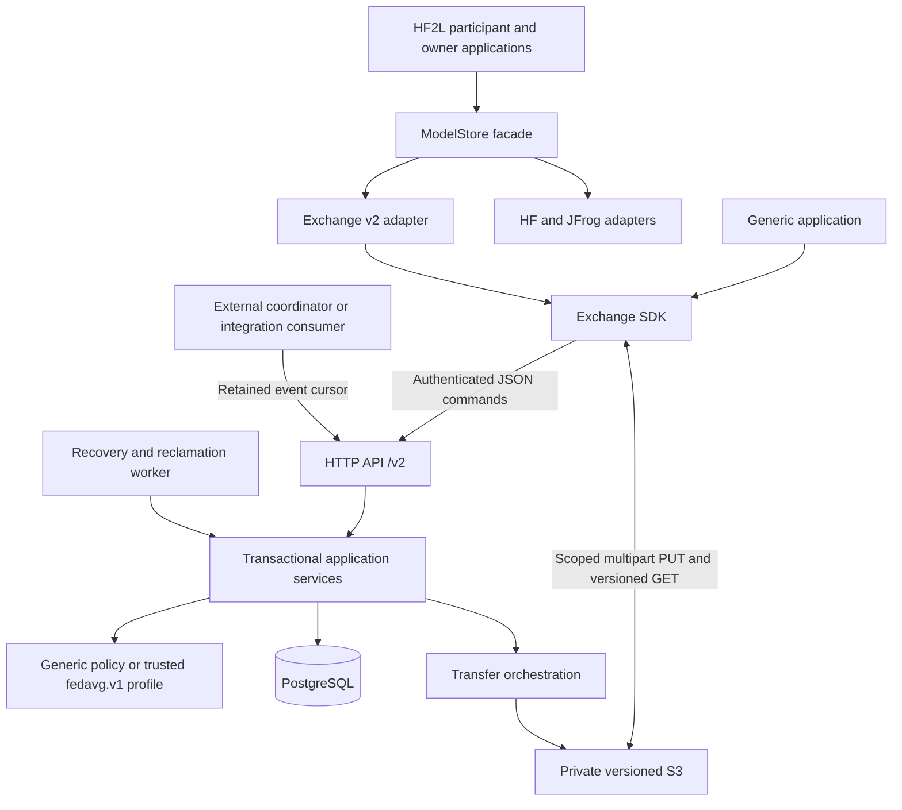

# Architecture review and Exchange v2 design

Review baseline: `714fd66` (Exchange v1). Design decision date: 2026-09-22.
The review concerns code and documentation in that baseline; line numbers below
refer to that revision. The v2 implementation lives in the independent
`hf_fl-v2` checkout. No deployment or package publication is implied.

[Exchange v2 operations and API](EXCHANGE_V2.md) describes the new implementation.
The [v1 operator guide](../EXCHANGE_SERVICE.md) and
[v1 design](EXCHANGE_SERVICE_DESIGN.md) remain references for the legacy service.

## Assessment

The split between a metadata API and direct private object-storage transfers is
the right foundation. It keeps large files off the API, gives the database
ownership of identity and authorization, and makes published records point to
verified immutable object versions. Existing compare-and-swap references,
operation keys, fenced leases, delayed reclamation and recovery tests are worth
preserving.

The principal problem is the boundary around that foundation. The v1 service
supports generic records but always applies FedAvg policy. HTTP routing,
persistence, workflow policy and transfer orchestration also share implementation
boundaries, while installation pulls the complete ML stack even for generic
clients. These are maintainability and product-contract problems rather than a
reason to replace PostgreSQL, S3, or the existing correctness mechanisms.

## Findings

| Priority | Finding and baseline evidence | Consequence and v2 decision |
|---|---|---|
| High | The design says FedAvg is one application (`EXCHANGE_SERVICE_DESIGN.md:14–17`), but every space requires `training.update` and `model.global` (`hf2l/exchange/api.py:160–206`) and `main` is model-specific (`:365–378`). | A neutral information exchange cannot choose its own complete vocabulary. Core spaces are generic; `fedavg.v1` is an explicitly selected trusted profile. |
| High | Claim inputs are always training updates (`hf2l/exchange/api.py:389–397`), even though the request has a configurable workflow string (`schemas.py:121–126`). | Renaming a workflow does not generalize its semantics. Core acquisitions freeze explicitly selected records and a reference generation. FedAvg owns participant selection and result provenance. |
| High | The generic SDK/service installation requires Torch, NumPy, SafeTensors and Hugging Face (`pyproject.toml:11–16`), despite the lightweight-SDK design goal. | Package `hf2l-exchange` independently, with server dependencies optional. Keep `hf2l` as the ML application and compatibility distribution. |
| High | `ModelStore` combines model initialization, submissions, aggregation and optional claims (`hf2l/backends/base.py:65–129`). HF conditionally commits while JFrog checks then writes (`huggingface.py:171–177`, `jfrog.py:296–303`). | Keep this as an FL facade, not the generic protocol. Expose backend publication capabilities and pass round/reference/acquisition context explicitly. Do not promise atomic publication where a backend only provides a preflight check. |
| Medium | HTTP handlers and `Service` in `hf2l/exchange/api.py` contain validation, authorization, SQL, profile policy, reference changes and transfer transitions. | Changes have a large regression surface. Separate HTTP transport, transactional application commands, domain contracts, policy, persistence and storage adapters. Keep one server deployment. |
| Medium | Mutable per-space kind rules apply to existing records, while `schema_version` is supplied by the client (`api.py`, `schemas.py:106–110`; `EXCHANGE_SERVICE.md:259–267`). | The schema that accepted a record is not an immutable type definition. Register immutable type revisions and bind a draft to one revision until publication. Keep current authorization distinct from schema identity. |
| Medium | Blob byte quotas do not constrain growth from records with no attachments. | Add retained-record and canonical-metadata-byte quotas. Keep system bookkeeping outside user admission quotas so exhausted capacity cannot prevent cancellation or cleanup. |
| Medium | The SDK combines authenticated control requests, retry policy, resumable byte transfer, local state and polling (`hf2l/exchange/client.py:58–87`, `:147–308`). Adapter instances retain current reference/claim state (`backends/exchange.py:80–82`). | Use typed descriptors, a control client, transfer manager and durable operation state. Pass workflow context rather than relying on call order on an adapter instance. |
| Medium | Primary publication followed by a tag failure is reported differently by Exchange, HF and JFrog (`backends/exchange.py:310–344`, `huggingface.py:179–192`, `jfrog.py:301–307`). | Preserve a confirmed primary revision in publication outcomes; report a secondary tag failure separately. An uncertain primary response requires reconciliation, not blind republishing. |
| Medium | Migration recognizes the old schema through one column and contains a single introspective upgrade (`hf2l/exchange/migrations.py:7–48`). | Start v2 with an explicit schema-revision ledger. V2 is a clean breaking deployment with no v1 data importer or compatibility server. |
| Medium | The design describes tenant isolation, push event delivery and paginated attachments (`EXCHANGE_SERVICE_DESIGN.md:32`, `:41`, `:58`, `:92`, `:173`), whereas the implementation has space isolation, a retained pull feed and bounded inline descriptors. Its appended clarifications partly contradict earlier sections. | Maintain one accurate current contract. Keep historical reviews and proposed capabilities visibly separate; correct contradictory paragraphs rather than append more exceptions. |
| Medium | Acceptance goals include multi-GB recovery, process crashes at every boundary and backup/restore (`EXCHANGE_SERVICE_DESIGN.md:496–505`), while representative tests use approximately 5 MiB multipart objects and in-process threads (`tests/test_exchange.py:272–288`, `:925–945`). CI also uses mutable provider tags. | Separate functional, provider, process-recovery and deployment evidence. Pin the integration-test provider. Tests establish only the scenarios actually exercised. |

## Target architecture

### Boundaries and dependency direction

- **Domain contracts** define identities, immutable type references, record and
  attachment descriptors, reference snapshots, acquisitions and transfer handles.
  They import neither FastAPI nor SQLAlchemy, S3, or ML libraries.
- **Application commands** own authorization and transaction boundaries. They
  expose complete operations such as publish, move a reference, acquire work and
  complete work. HTTP and the worker use the same invariants.
- **Profiles** are trusted installed code. Generic policy is sufficient for
  records, files and ordinary references. Optional `fedavg.v1` adds model types,
  participant attribution, protected model references and provenance checks.
  A space's profile is immutable. Client metadata cannot choose code to execute.
- **Persistence** uses SQLAlchemy and PostgreSQL, with SQLite for local functional
  tests. A revision ledger makes supported database state explicit. DB-backed
  scheduling remains sufficient; no message broker is required.
- **Storage** implements one typed contract for versioned S3 multipart transfer,
  reconciliation, exact-version verification, signing and cleanup. Additional
  providers require implementations and conformance evidence before support is
  claimed.
- **SDK** contains control-plane HTTP, typed public values, transfer orchestration
  and durable local operation state. Only the transfer component handles file
  bytes; it never forwards the API bearer token to storage.
- **HF2L** retains checkpoint/tensor rules, training plugins, averaging and owner
  evaluation. `ModelStore` remains its application facade. Backend capabilities
  distinguish conditional publication, ancestry, PR discovery and coordination.

This is a modular service, not a set of new microservices. Avoid a repository
interface for every table, a workflow configuration language, dynamic server
plugin discovery, or a provider registry without a demonstrated second use case.

### Resource and policy model

A **space** is the authorization and quota boundary. No tenant isolation is
inferred from a free-text label. Members receive explicit `reader`, `contributor`,
`publisher` and/or `admin` roles; administration does not implicitly grant data
access. Current membership is required for new reads, writes and transfer grants.

A **type revision** is immutable and records its schema identity and profile
version. Current kind access policy is a separate mutable resource.
A record selects its type revision at draft creation; later type registration
never silently revalidates that draft against a different schema. Published
metadata and attachment identities are immutable. Current access policy and
membership remain enforceable independently of that historical content contract.

A **record** is bounded JSON metadata plus zero or more declared attachments.
Generic records require neither a training base nor a participant nor any model
filename. **References** point to shared published records and change only with an
explicit precondition. Their generations must not reset through a delete/recreate
path. A profile can protect selected references, but every command path must
apply its protection.

An **acquisition** identifies one attempt to produce a result for a reference.
It captures a reference generation, a frozen explicit input set, a holder, a
renewable lease and a fencing value. At most one active acquisition may own a
space/reference. Completion validates the live ownership and result, advances
the reference, records completion and emits events in one transaction. Replaying
successful completion returns its recorded outcome. FedAvg input selection and
final eligibility are additional profile behavior, not generic claim semantics.

### Transfer and consistency invariants

1. Reserve metadata and quota before contacting S3. Declared size and digest are
   not verification evidence. Publication requires verification of the exact
   stored object version and records the verified handle.
2. A database lease fences database commits, not S3 side effects. Give transfer
   attempts separate owned handles/keys. A stale worker may finish I/O but may
   neither commit a successor's result nor delete the successor's upload.
3. Preserve resumable state before the first creating request. Operation keys
   identify requests, not OAuth principals. Never recover a separate job merely
   because it uses the same identity.
4. No S3 operation and DB transaction commit atomically. Persist recoverable
   transitions, keep lengthy S3 work outside locked transactions, and reconcile
   lost responses against attempt-owned resources.
5. Track issued grant expiry. Revocation blocks new grants but cannot revoke
   previously issued bearer URLs. Reclaim only after the latest possible grant
   has expired. Cleanup failure retains pending-deletion quota and remains
   repairable; it must not masquerade as successful reclamation. Track provider
   mutations independently of database leases. A vanished callback retains its
   marker and quota until an offline operator has stopped writers, established
   provider quiescence and scheduled safe recovery or cleanup. Completing
   drafts retain their multipart handle and uploaded parts; uncertain initiation
   is cleaned before a replacement upload may start. Read-only verification
   remains automatically restartable.
6. Account for blob reservations, physical pending deletion, record count and
   canonical metadata bytes. Retention and explicit removal must release each
   budget at its defined lifecycle point. Events and idempotency history have
   bounded retention. Coordination provenance remains retained indefinitely in
   this version; administrators can increase space quotas, but cannot erase that
   history through record purge.
7. Event delivery is an authorized retained pull feed. Consumers persist cursors,
   deduplicate and reconcile when their cursor expires. Webhook delivery, retries
   and acknowledgements belong to an external integration consumer. Authorized
   terminal-state tombstones let consumers invalidate local entries without
   exposing withdrawn content.

### Compatibility and deployment decision

The new distribution is `hf2l-exchange`, imported as `hf2l_exchange`; its HTTP
surface is `/v2`. The package version, API version, database revision and profile
version are separate identifiers. The first package is an unreleased development
version, not a published release.

V2 uses a **fresh database and fresh storage prefix**. It does not import v1 data,
serve `/v1`, silently reinterpret v1 records or upgrade an existing v1 database.
The legacy code and documentation remain available separately. Existing HF/JFrog
application backends remain supported by HF2L; the v2 Exchange adapter uses the
new service contract. Deployment cutover requires explicitly creating v2 spaces,
identities and application state. Do not point v2 initialization at a v1 database.

## Implementation sequence

1. Establish the independent package, typed contracts, dependency checks,
   PostgreSQL/SQLite metadata model and explicit initial database revision.
2. Implement generic spaces, memberships, immutable type revisions, records,
   quota accounting, references, events and acquisitions behind application
   commands. Exercise a metadata-only application before adding FL policy.
3. Implement attempt-owned multipart upload, exact-version verification,
   reconciliation and delayed physical cleanup; expose it through the SDK.
4. Bind the HTTP routes and supervised API/worker commands to these services.
   Ship S3 as the only storage adapter and document its permissions and TLS model.
5. Add the optional FedAvg profile and application adapter; keep explicit context,
   capability checks and primary/secondary publication outcomes across backends.
6. Integrate functional tests, real PostgreSQL/S3 tests, process recovery,
   minimal-package import checks and the existing HF2L regression suite. Update
   the operator guide from the implemented interfaces and measured results.

## Acceptance and evidence

| Area | Required scenario | Evidence category |
|---|---|---|
| Generality | Metadata-only and arbitrary-file exchange, a non-model `main`, no FedAvg kinds or manifest fields | Core/API/SDK integration |
| Packaging | SDK and server import and operate in separate fresh environments without Torch/HF | Minimal-install checks |
| Policy | Generic and FedAvg spaces coexist; generic routes cannot bypass a protected FedAvg reference or result check | Authorization/profile integration |
| Type evolution | New revision affects new drafts; an existing draft/published record keeps its original revision | Domain/API integration |
| Capacity | Metadata-only growth is bounded; cancellation and reclamation remain possible at quota | Persistence/lifecycle integration |
| Concurrency | Competing writers yield one accepted reference change; stale acquisitions/transfers cannot commit or remove successor resources | PostgreSQL concurrency and process tests |
| Recovery | Lost responses, interruption, expiry, SDK restart, verification failure and cleanup retries preserve invariants; orphan provider mutations retain quota until explicit safe repair | Deterministic failures plus process/operator-repair tests |
| Storage | Exact versions, multipart resume, grant signature/expiry and delayed cleanup work with the pinned provider | Provider integration |
| Compatibility | Existing HF/JFrog behavior, explicit capabilities and successful publication with tag failure | HF2L regression/adapter tests |
| Operations | Chosen TLS/IAM/IdP, retention, backup/restore and representative capacity/throughput | Deployment acceptance, not inferred from unit tests |

Current test results and remaining limits belong in the v2 runbook. Historical
v1 counts are not evidence for v2. Passing local integration tests does not prove
production throughput, support for every S3-compatible server, or a backup and
restore objective.
